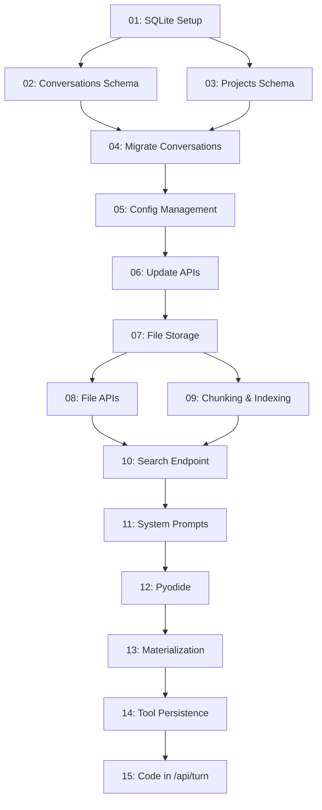

# Implementation Roadmap

**Status**: Planning complete, ready to start Phase 1a

This roadmap breaks down the [vision](./VISION.md) into implementable steps. Each step is scoped to **one session** and **one PR**.

## Overview

```
Phase 1a: Foundations (Week 1)
├─ 01: SQLite setup ✓ Can parallelize
├─ 02: Conversations schema
├─ 03: Projects schema       ✓ Can parallelize with 02
├─ 04: Migrate conversations
├─ 05: Config management
└─ 06: Update APIs

Phase 1b: Files & Retrieval (Week 2)
├─ 07: File storage schema
├─ 08: File upload/read APIs
├─ 09: Chunking & indexing
├─ 10: FTS5 search endpoint
└─ 11: Update system prompts

Phase 1c: Code Execution (Week 3-4, Optional)
├─ 12: Pyodide integration
├─ 13: Filesystem materialization
├─ 14: Tool persistence
└─ 15: Execution in /api/turn

Phase 2: Enhanced Retrieval (Week 5+)
├─ 16: Token budget management
├─ 17: Automatic retrieval in turns
├─ 18: Agentic search tool
└─ 19: Conversation summaries

Phase 3: Advanced Features (Future)
├─ 20: Local embeddings
├─ 21: Hybrid search
├─ 22: Multi-user foundations
└─ ...
```

## Dependency Graph



## Phase 1a: Foundations (Week 1)

**Goal**: Move from in-memory to persistent SQLite storage without breaking existing functionality.

| Step | Name | Spec | Complexity | Can Parallelize |
|------|------|------|------------|-----------------|
| 01 | SQLite Setup | [specs/01-sqlite-setup.md](specs/01-sqlite-setup.md) | Low | Start here |
| 02 | Conversations Schema | [specs/02-conversations-schema.md](specs/02-conversations-schema.md) | Medium | After 01 |
| 03 | Projects Schema | [specs/03-projects-schema.md](specs/03-projects-schema.md) | Low | After 01, parallel with 02 |
| 04 | Migrate Conversations | [specs/04-migrate-conversations.md](specs/04-migrate-conversations.md) | Medium | After 02+03 |
| 05 | Config Management | [specs/05-config-management.md](specs/05-config-management.md) | Medium | After 04 |
| 06 | Update APIs | [specs/06-update-apis.md](specs/06-update-apis.md) | High | After 05 |

**Deliverable**: Server restarts without losing conversations. Existing UI works unchanged.

## Phase 1b: Files & Retrieval (Week 2)

**Goal**: Add file upload and FTS5 search. Models can see and search project files.

| Step | Name | Spec | Complexity | Can Parallelize |
|------|------|------|------------|-----------------|
| **00** | **Write Phase 1b Specs** | [specs/00-write-phase-1b-specs.md](specs/00-write-phase-1b-specs.md) | **Low (1-2h)** | **Start of phase** |
| 07 | File Storage Schema | [specs/07-file-storage.md](specs/07-file-storage.md) | Medium | After spec writing |
| 08 | File Upload/Read APIs | [specs/08-file-apis.md](specs/08-file-apis.md) | Medium | After 07 |
| 09 | Chunking & Indexing | [specs/09-chunking-indexing.md](specs/09-chunking-indexing.md) | High | After 07, parallel with 08 |
| 10 | FTS5 Search Endpoint | [specs/10-search-endpoint.md](specs/10-search-endpoint.md) | Medium | After 09 |
| 11 | Update System Prompts | [specs/11-system-prompts.md](specs/11-system-prompts.md) | Low | After 10 |

**Deliverable**: Upload files to project, search finds relevant chunks, models see file list in context.

## Phase 1c: Code Execution (Weeks 3-4, Optional)

**Goal**: Enable Python code execution for smart models with tool persistence.

| Step | Name | Spec | Complexity | Can Parallelize |
|------|------|------|------------|-----------------|
| **00** | **Write Phase 1c Specs** | [specs/00-write-phase-1c-specs.md](specs/00-write-phase-1c-specs.md) | **Low (1-2h)** | **Start of phase** |
| 12 | Pyodide Integration | [specs/12-pyodide.md](specs/12-pyodide.md) | High | After spec writing |
| 13 | Filesystem Materialization | [specs/13-materialization.md](specs/13-materialization.md) | Medium | After 12 |
| 14 | Tool Persistence | [specs/14-tool-persistence.md](specs/14-tool-persistence.md) | Medium | After 13 |
| 15 | Execution in API | [specs/15-code-in-api.md](specs/15-code-in-api.md) | High | After 14 |

**Deliverable**: Models can execute Python, read project files, create tools that persist.

**Note**: This phase is optional! Can deploy 1a+1b first for a working file-aware chat system.

## Phase 2: Enhanced Retrieval (Week 5+)

**Goal**: Automatic context management with retrieval, agentic search, summaries.

| Step | Name | Spec | Complexity |
|------|------|------|------------|
| **00** | **Write Phase 2 Specs** | [specs/00-write-phase-2-specs.md](specs/00-write-phase-2-specs.md) | **Medium (2-3h)** |
| 16 | Token Budget Management | [specs/16-token-budgets.md](specs/16-token-budgets.md) | Medium |
| 17 | Auto-Retrieval | [specs/17-auto-retrieval.md](specs/17-auto-retrieval.md) | High |
| 18 | Agentic Search Tool | [specs/18-agentic-search.md](specs/18-agentic-search.md) | Medium |
| 19 | Conversation Summaries | [specs/19-summaries.md](specs/19-summaries.md) | Low |

**Deliverable**: Long conversations stay within context via automatic retrieval. Models can search for specific information.

## Phase 3: Advanced Features (Future)

**Goal**: Local embeddings, hybrid search, multi-user foundations.

| Step | Name | Spec | Complexity |
|------|------|------|------------|
| **00** | **Write Phase 3 Specs** | [specs/00-write-phase-3-specs.md](specs/00-write-phase-3-specs.md) | **Medium (2-3h)** |
| 20 | Local Embeddings | [specs/20-embeddings.md](specs/20-embeddings.md) | High |
| 21 | Hybrid Search | [specs/21-hybrid-search.md](specs/21-hybrid-search.md) | High |
| 22 | Multi-User Schema | [specs/22-multi-user.md](specs/22-multi-user.md) | Medium |
| 23 | Cost Tracking | [specs/23-cost-tracking.md](specs/23-cost-tracking.md) | Low |

## Parallelization Notes

### Within Phase 1a
- **Step 02 and 03** can be done in parallel (conversations and projects schemas are independent)
- Everything else is sequential

### Within Phase 1b
- **Step 08 and 09** can be started simultaneously once 07 is done
- 08 (file APIs) and 09 (indexing) work on different parts of the system

### Across Phases
- Can start **Phase 2** planning while implementing Phase 1c
- Phase 1c is independent - can skip and do Phase 2 first if desired

## Complexity Legend

- **Low**: 1-2 hours, straightforward implementation
- **Medium**: 2-4 hours, requires thought and testing
- **High**: 4-8 hours, complex logic or multiple systems integration

## Current Status

- [x] Architecture reviews complete
- [x] Detailed specs written
- [ ] Phase 1a: **Ready to start**
- [ ] Phase 1b: Blocked by 1a
- [ ] Phase 1c: Optional, can skip
- [ ] Phase 2+: Future planning

## Next Steps

1. **Start with Step 01**: [SQLite Setup](specs/01-sqlite-setup.md)
2. Review spec, implement, test
3. Create PR with changes
4. Move to Step 02

---

**Previous**: [VISION.md](./VISION.md) | **Reference**: [ARCHITECTURE.md](./ARCHITECTURE.md)
